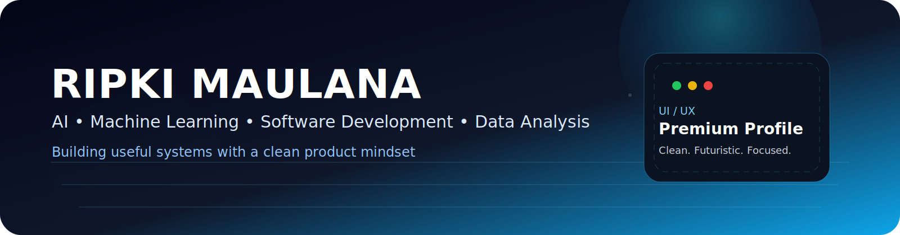
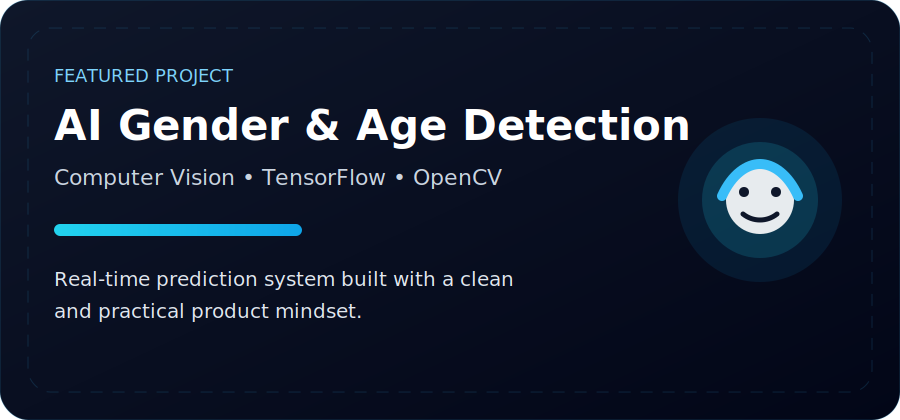
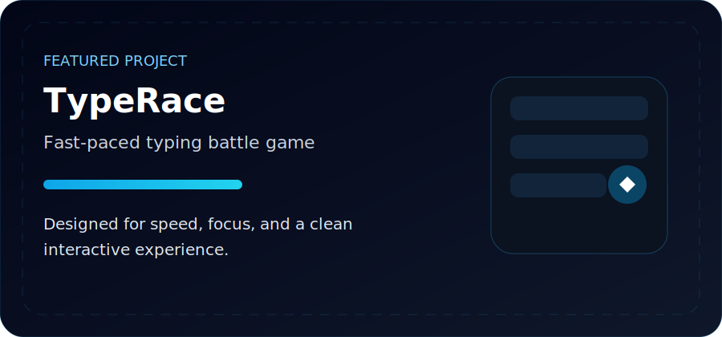
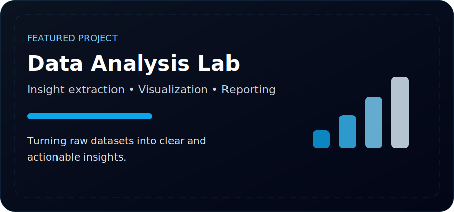
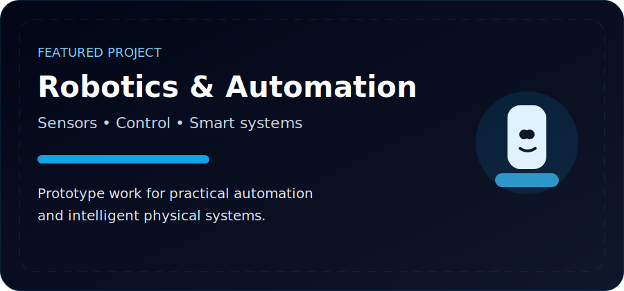
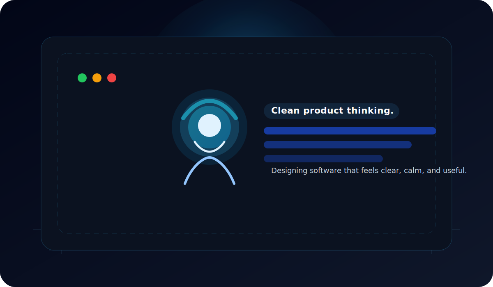

<!--
  Ripki Maulana — GitHub Profile README
  Theme: Premium / Clean / Futuristic / Neon Blue
  Replace:
  - YOUR_USERNAME
  - YOUR_EMAIL
  - YOUR_LINKEDIN
  - YOUR_KAGGLE
  - YOUR_PORTFOLIO
  - project links
-->

<div align="center">



<br/>


</div>

---

## About

Hi, I am **Ripki Maulana** — an Informatics student who enjoys building products that feel clean, useful, and thoughtful.

My focus is on:
- Artificial Intelligence
- Machine Learning
- Computer Vision
- Data Analysis
- Web Development
- Robotics and automation

I like turning ideas into working systems, then refining them until they feel polished.

---

## Current Focus

<div align="center">

| Area | Focus |
|---|---|
| AI / ML | model building, prediction, classification |
| CV | image-based detection and real-time inference |
| Web | dashboard, landing page, and app interfaces |
| Data | exploration, visualization, insight extraction |
| Systems | practical tools and automation |

</div>

---

## Tech Stack

<div align="center">


</div>

---

## Featured Projects

<div align="center">

<table>
  <tr>
    <td width="50%" valign="top">
      
    </td>
    <td width="50%" valign="top">
      
    </td>
  </tr>
  <tr>
    <td width="50%" valign="top">
      
    </td>
    <td width="50%" valign="top">
      
    </td>
  </tr>
</table>

</div>

### Project Highlights

- **TypeRace** — typing battle game built for speed and focus.
- **4 Seasons OpenGL** — computer graphics project with seasonal environments.
- **AI Gender & Age Detection** — computer vision model for real-time inference.
- **GiziCare** — nutrition-focused platform for practical health support.
- **Food Rescue** — social-impact platform to reduce food waste.
- **Data Analysis Projects** — exploration of datasets to find useful insights.

---

## GitHub Analytics

<div align="center">


</div>

<div align="center">


</div>

<div align="center">


</div>

---

## Progress


<div align="center">

| Skill | Level |
|---|---:|
| Python | 95% |
| Machine Learning | 90% |
| Web Development | 85% |
| Computer Vision | 80% |
| Data Analysis | 78% |
| Robotics | 65% |

</div>


---

## Learning Roadmap

- Deep Learning
- Advanced Computer Vision
- Better UI / UX systems
- Scalable backend architecture
- Robotics integration
- Open-source contribution

---

## Timeline

<div align="center">

```text
2023  -> Started programming
2024  -> Built web applications
2025  -> Explored AI and data science
2026  -> Focused on machine learning and product quality
Future -> Build intelligent products people actually use
```

</div>

---

## Profile Illustration

<div align="center">
  
</div>

---

## Contact

<div align="center">

<a href="mailto:YOUR_EMAIL@example.com">
  
</a>
<a href="https://www.linkedin.com/in/YOUR_LINKEDIN">
  
</a>
<a href="https://www.kaggle.com/YOUR_KAGGLE">
  
</a>
<a href="https://YOUR_PORTFOLIO">
  
</a>

</div>

---

<div align="center">


</div>
